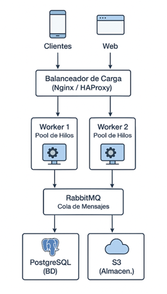

# PFO3: Rediseño como Sistema Distribuido (Cliente-Servidor)

## Descripción
Este proyecto implementa un sistema distribuido en arquitectura cliente-servidor usando Python, sockets y RabbitMQ, con persistencia de resultados en PostgreSQL y almacenamiento de archivos en MinIO (S3 compatible).

El sistema permite:
- Clientes móviles o web que envían tareas.  
- Servidores worker que procesan tareas concurrentemente usando ThreadPool.  
- Coordinación de múltiples servidores/workers mediante RabbitMQ.  
- Persistencia de resultados en PostgreSQL y archivos grandes en MinIO.  

---

## Arquitectura



**Componentes:**
1. **Clientes:** envían tareas al servidor.  
2. **Balanceador de carga (Nginx/HAProxy):** distribuye las solicitudes entre los servidores workers.  
3. **Servidores Worker:** procesan tareas concurrentemente con ThreadPoolExecutor.  
4. **RabbitMQ:** gestiona la cola de tareas entre servidores y workers.  
5. **PostgreSQL:** almacena resultados de tareas.  
6. **MinIO (S3):** almacena archivos grandes o datos binarios.  

---

## Estructura del proyecto
```bash
📁PFO3_Redes/
├── 📄servidor.py               # Servidor básico con sockets
├── 📄servidor_threadpool.py    # Servidor mejorado con ThreadPool
├── 📄servidor_rabbit.py        # Servidor que publica tareas en RabbitMQ
├── 📄cliente.py                # Cliente que envía y recibe tareas
├── 📄worker_rabbitmq.py        # Worker remoto que procesa tareas desde RabbitMQ
├── 📄worker_rabbitmq_persist.py # Worker que guarda resultados en PostgreSQL
├── 📄README.md                 
└── 📄diagrama.png              # Diagrama de arquitectura

```

---

## Requisitos

- Python 3.x  
- Docker (para RabbitMQ, PostgreSQL y MinIO)  
- Librerías Python:
```bash
pip install pika psycopg2-binary
```

## Configuración de servicios con Docker
1. RabbitMQ
```bash
docker run -d --name rabbitmq -p 5672:5672 -p 15672:15672 rabbitmq:3-management
```
- Panel web: http://localhost:15672
- Usuario/Pass: guest / guest

2. PostgreSQL
```bash
docker run --name pfo3-postgres -e POSTGRES_PASSWORD=1234 -p 5432:5432 -d postgres:15
``` 
- Base de datos: tasksdb
- Tabla: tareas_resultados

3. MinIO(S3)
```bash
docker run -d --name pfo3-minio -p 9001:9001 quay.io/minio/minio server /data
```
- Panel web: http://localhost:9001
- Usuario/Pass: minioadmin / minioadmin

## Ejecución del sistema
1. Abrir 3 terminales
- Terminal 1 - Worker
```bash
python worker_rabbitmq_persist.py
```
- Terminal 2 - Servidor
```bash
python servidor_rabbit.py
```
- Terminal 3 - Cliente
```bash
python cliente.py
```
- Ingresar la tarea (por ejemplo: "procesar datos").
- Verificar que el worker procesa la tarea y la guarda en PostgreSQL y MinIO.
2. Consultar resultados en PostgreSQL:
```bash
docker exec -it pfo3-postgres bash
psql -U postgres -d tasksdb
SELECT * FROM tareas_resultados;
```
## Pruebas realizadas
- Múltiples clientes concurrentes envían tareas.
- Servidor distribuye tareas a workers vía RabbitMQ.
- Workers procesan tareas, guardan resultados en PostgreSQL y archivos en MinIO.
- Todo funciona de manera distribuida y concurrente.
## Documentación y capturas
Se incluye un PDF con el paso a paso, pruebas y capturas de terminales, RabbitMQ, MinIO y PostgreSQL:

- [Abrir PDF desde Google Drive](https://drive.google.com/file/d/19xXCK2_mZjykRHDufpfBRRK75m4mUlWE/view?usp=sharing)
